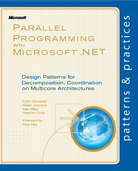
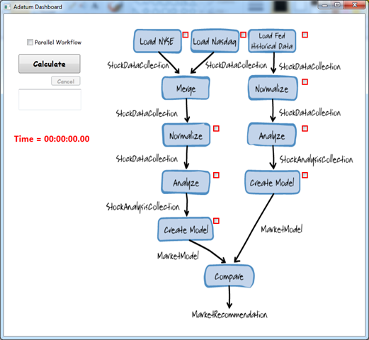

# Parallel Programming with Microsoft .NET

**Design Patterns for Decomposition and Coordination on Multicore Architectures**  
Colin Campbell, Ralph Johnson, Ade Miller and Stephen Toub. Foreword by Tony Hey  

 A book that introduces .NET programmers to patterns for including parallelism in their applications. Examples of these patterns are parallel loops, parallel tasks and data aggregation with map-reduce. Each pattern has its own chapter. Each chapter includes a description of the problem, an example of where the pattern is applicable, and code that implements the solution. On this site you will find; a preliminary draft of the book, the accompanying code samples and answers to the end of chapter questions.

[**Order the hardcopy book or buy the eBook from O’Reilly**](http://oreilly.com/catalog/0790145310262) 

*   $29.99 for the hardcopy, $23.99 for the eBook.

*   Also on [Safari Books online](http://my.safaribooksonline.com/9780735651821) and [Amazon.com](http://www.amazon.com/dp/0735651590?tag=alpineclimbin-20&camp=14573&creative=327641&linkCode=as1&creativeASIN=0735651590&adid=0MC4ZZ60BXG9VQHV0MYA&).

[**Read the book online in the MSDN Library**](http://msdn.microsoft.com/en-us/library/ff963553.aspx )

*   Read the book content for free on MSDN!

[**Download the samples for each chapter in C#, Visual Basic and F#**](http://parallelpatterns.codeplex.com/releases/view/50473)

*   [Blog posts about the F# samples](http://tomasp.net/blog/fsharp-parallel-samples.aspx)

The samples are written in C#, F#  and Visual Basic and use the new [parallel programming model ](http://msdn.microsoft.com/en-us/library/dd460693(VS.100).aspx) that shipped with [Visual Studio 2010](http://www.microsoft.com/visualstudio/en-us/products/2010-editions). The samples use the parallel features of the .NET Framework version 4, which includes the [Task Parallel Library (TPL)](http://msdn.microsoft.com/en-us/library/dd460717(VS.100).aspx) and [Parallel LINQ (PLINQ)](http://msdn.microsoft.com/en-us/library/dd460688(VS.100).aspx).

**Demos and Talks**

 The demo that does along with the TechEd 2010 [ parallel patterns talk](http://www.ademiller.com/blogs/tech/2010/06/patterns-of-parallel-programming-teched-talk-online/) is also available. This is essentially the sample from Chapter 5 of “[Parallel Programming with Microsoft .NET](http://parallelpatterns.codeplex.com/)” with additional work to show additional patterns used within the same sample to enhance performance of the individual steps within the overall workflow. It also has a much nicer UI and checkboxes that allow the user to select parallel and sequential versions of different parts of the application.

[**Watch a video of Patterns of Parallel Programming talk at TechEd 2010**](http://www.msteched.com/2010/NorthAmerica/ARC205)

**[Talk source code and screenshots](http://parallelpatterns.codeplex.com/releases/view/50473#DownloadId=166248)**

**What about C++?**  

Interested in parallel programming but prefer C++? We have also produced a companion book for C++ developers using the [Parallel Patterns Library (PPL)](http://msdn.microsoft.com/en-us/library/dd492418(VS.100).aspx) and [Asynchronous Agents Library](http://msdn.microsoft.com/en-us/library/dd492627.aspx). You can find out more about it on our other CodePlex site [Parallel Programming with Microsoft Visual C++](http://parallelpatternscpp.codeplex.com/).  

**System Requirements**  

You will need .NET 4 and at least [Visual Studio 2010 Professional](http://www.microsoft.com/visualstudio/en-us/download) to run the samples. However, you will need [Visual Studio 2010 Ultimate](http://www.microsoft.com/visualstudio/en-us/download) to use some the parallel diagnostic tools such as the Concurrency Visualizer.  

**Relevant Blogs**  

Here are some blogs that will keep you up to date with what’s happening with this guide and with parallel programming at Microsoft.  

[Ade Miller: #2782](http://www.ademiller.com/blogs/tech/) - patterns & practices development manager and book author.  

[Stephen Toub: .NET, MSDN Magazine, and other Adventures in Life](http://blogs.msdn.com/toub/default.aspx) Parallel Extensions for .NET team Program Manager and book author.

[TomasP.NET](http://tomasp.net/blog/fsharp-parallel-samples.aspx) - F# programming, including a series of blog posts on the F# versions of the book samples.  

[Parallel Programming with .NET](http://blogs.msdn.com/pfxteam/default.aspx) – The Parallel Extensions for .NET Team blog.  

[Patterns for Parallel Programming: Understanding and Applying Parallel Patterns with the .NET Framework 4 - Stephen Toub](http://www.microsoft.com/downloads/details.aspx?FamilyID=86b3d32b-ad26-4bb8-a3ae-c1637026c3ee&displaylang=en) – A white paper from one of the book’s authors.   

[Samples for Parallel Programming with the .NET Framework 4](http://code.msdn.microsoft.com/ParExtSamples) – Additional samples provided by the Parallel Extensions for .NET team.
